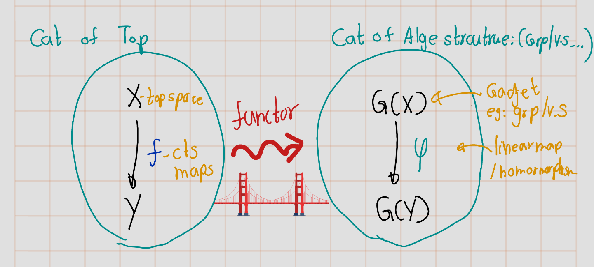

--- 
title: "Algbric Topogy"
author: "Ashan De Silva"
date: "`r Sys.Date()`"
site: bookdown::bookdown_site
documentclass: book
bibliography: [book.bib, packages.bib]
# url: your book url like https://bookdown.org/yihui/bookdown
# cover-image: path to the social sharing image like images/cover.jpg
description: |
  This is a minimal example of using the bookdown package to write a book.
  The HTML output format for this example is bookdown::gitbook,
  set in the _output.yml file.
link-citations: yes
github-repo: rstudio/bookdown-demo
---

# Introduction

### What is Algberic topolgy?

Roughly  it's about tools/methods connecting **algebra** and **topology**.

The "*bridge*" is **algebraic topology**.

In order to be useful, the associations \[ X \leftsquigarrow G(X) \quad \text{and} \quad f \leftsquigarrow \varphi_f \] ought to satisfy some properties.

| Property | Mathematical Form |
|:-|:-------------------|
| **Identity** \
**Preservation** | \(\mathrm{id}_X : X \to X \;\mapsto\; \mathrm{id}_{G(X)} : G(X) \to G(X)\) |
| **Composition**\
**Compatibility** | If \(f : X \to Y\) and \(g : Y \to Z\), then \((g \circ f) : X \to Z \;\mapsto\; \varphi_g \circ \varphi_f : G(X) \to G(Z)\) |

$$\leftsquigarrow$$